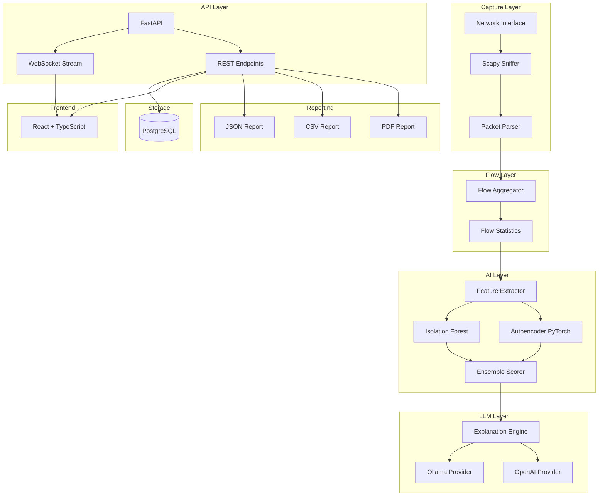

# AI Packet Analyzer

> A Wireshark-inspired, AI-powered network traffic analyzer that captures packets, aggregates flows, detects anomalies with ML models, and explains network behavior in plain English using LLMs.


---

## Screenshots

| Live Packets | Anomalies | AI Insights |
|---|---|---|
| *(screenshot placeholder)* | *(screenshot placeholder)* | *(screenshot placeholder)* |

---

## Architecture



---

## Features

| Phase | Feature | Status |
|-------|---------|--------|
| 1 | Packet capture (TCP/UDP/ICMP/DNS/HTTP/HTTPS/ARP) | ✅ |
| 2 | Bidirectional flow aggregation with rich statistics | ✅ |
| 3 | Isolation Forest + Autoencoder anomaly detection | ✅ |
| 4 | LLM explanation engine (Ollama / OpenAI) | ✅ |
| 5 | React dashboard with WebSocket live streaming | ✅ |
| 6 | JSON / CSV / PDF report generation | ✅ |

---

## Quick Start

### Prerequisites

- Python 3.12+
- Node.js 20+
- PostgreSQL 16 (or Docker)
- [Ollama](https://ollama.ai) (optional, for local LLM)
- `libpcap-dev` (Linux) or Npcap (Windows)

### 1. Clone

```bash
git clone https://github.com/your-username/ai-packet-analyzer.git
cd ai-packet-analyzer
```

### 2. Configure

```bash
cp .env.example .env
# Edit .env — set DATABASE_URL, LLM_PROVIDER, CAPTURE_INTERFACE
```

### 3. Start with Docker (recommended)

```bash
make docker-up
# Backend: http://localhost:8000/api/docs
# Frontend: http://localhost:3000
```

### 4. Or run locally

```bash
# Backend
cd backend
pip install -r requirements.txt
alembic upgrade head
uvicorn app.main:app --reload

# Frontend (new terminal)
cd frontend
npm install
npm run dev
```

### 5. Pull the Ollama model

```bash
ollama pull llama3.2
```

---

## API Reference

Interactive docs available at **`http://localhost:8000/api/docs`**

| Method | Endpoint | Description |
|--------|----------|-------------|
| GET | `/api/v1/packets` | List captured packets |
| GET | `/api/v1/flows` | List network flows |
| GET | `/api/v1/anomalies` | List detected anomalies |
| POST | `/api/v1/insights` | Get LLM explanation for a flow |
| GET | `/api/v1/statistics` | Aggregate traffic statistics |
| POST | `/api/v1/reports` | Generate JSON/CSV/PDF report |
| WS | `/ws/packets` | Live packet stream |
| WS | `/ws/anomalies` | Live anomaly alerts |

Full API documentation: [docs/api.md](docs/api.md)

---

## Development

```bash
# Run tests
make test

# Lint
make lint

# Type check
make type-check

# Format
make format
```

Test coverage target: **80%+**

---

## Project Structure

```
ai-packet-analyzer/
├── backend/
│   ├── app/
│   │   ├── capture/          # Scapy capture + parser
│   │   ├── flow/             # Flow aggregation + statistics
│   │   ├── ai/               # Isolation Forest + Autoencoder
│   │   ├── llm/              # Explanation engine + providers
│   │   ├── api/              # FastAPI routes + WebSocket
│   │   ├── reporting/        # JSON / CSV / PDF generation
│   │   ├── database/         # SQLAlchemy async connection
│   │   └── models/           # ORM models
│   └── tests/
├── frontend/
│   └── src/
│       ├── pages/            # 6 dashboard pages
│       ├── components/       # Charts, layout
│       ├── hooks/            # useWebSocket
│       ├── services/         # Axios API client
│       ├── store/            # Zustand state
│       └── types/            # TypeScript interfaces
├── docker/
│   └── docker-compose.yml
├── docs/
└── .github/workflows/ci.yml
```

---

## Roadmap

- [ ] PCAP file import / replay
- [ ] GeoIP enrichment for IP geolocation
- [ ] eBPF-based kernel capture mode
- [ ] Alert rules engine (Sigma rules)
- [ ] Grafana dashboard integration
- [ ] STIX/TAXII threat intel feed connector
- [ ] Kubernetes Helm chart


